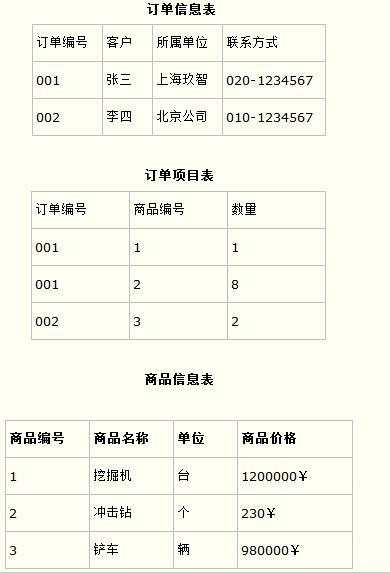

#2019.08.06 自学笔记

##一、C++基础知识

#### 1. 堆与栈的区别

(1) 堆是静态的，由用户主动申请和释放；栈是动态的，用来保存程序的局部变量。

(2) 申请后系统的响应不同
栈：只要栈的剩余空间大于申请空间，系统就为程序提供内存，否则将抛出栈溢出异常
堆：当系统收到程序申请时，先遍历操作系统中记录空闲内存地址的链表，寻找第一个大于所申请空间的堆结点，然后将该结点从空间结点链表中删除，并将该结点的空间分配给程序。
(3）申请大小限制的不同
栈：在windows下，栈的大小一般是2M，如果申请的空间超过栈的剩余空间时，将提示overflow。
堆：堆是向高地址扩展的数据结构，是不连续的内存区域。这是由于系统是用链表来存储的空闲内存地址的，自然是不连续的，而链表的遍历方向是由低地址向高地址。堆的大小受限于计算机系统中有效的虚拟内存。由此可见，堆获得的空间比较灵活，也比较大。

#### 2. C++文件编译与执行的四个阶段

第一阶段：预处理阶段。根据文件中的预处理指令来修改源文件的内容。如#include指令，作用是把头文件的内容添加到.cpp文件中。

第二阶段：编译阶段，将其翻译成等价的中间代码或汇编代码。

第三阶段：汇编阶段，把汇编语言翻译成目标机器指令。

第四阶段：是链接，例如，某个源文件中的函数可能引用了另一个源文件中定义的某个函数；在程序中可能调用了某个库文件中的函数。

#### 3. 引用和指针的区别与联系

**区别**

指针是一个实体他在栈中有自己使用的空间，但是引用没有；
引用必须初始化，指针不用但是最好初始化
指针使用时必须加*，引用不用；
引用只能初始化一次，指针不是；
引用不用const去修饰，但是指针可以
指针和地址运用自增（++）不同，引用是值进行自增，而指针是地址进行自增；

**联系**

引用的内部使用指针实现的
引用是受了限制的指针

#### 4. static关键字的作用

(1)隐藏。 当我们同时编译多个文件时，所有未加static前缀的全局变量和函数都具有全局可见性，故使用static在不同的文件中定义同名函数和同名变量，而不必担心命名冲突。
(2)static的第二个作用是保持变量内容的持久。存储在静态数据区的变量会在程序刚开始运行时就完成初始化，也是唯一的一次初始化。共有两种变量存储在静态存储区：全局变量和static变量。
(3)static的第三个作用是默认初始化为0.其实全局变量也具备这一属性，因为全局变量也存储在静态数据区。在静态数据区，内存中所有的字节默认值都是0×00,某些时候这一特点可以减少程序员的工作量。

#### 5. C++中的什么是多态性? 是如何实现的?

答：多态性是面向对象程序设计语言继数据抽象和继承之后的第三个基本特征。它是在运行时出现的多态性通过派生类和虚函数实现。C++的多态性是通过虚函数来实现的，虚函数允许子类重新定义成员函数，而子类重新定义父类的做法称为覆盖(override)，或重写。而重载则是允许有多个同名的函数，而这些函数的参数列表不同，允许参数个数不同，参数类型不同。编译器会根据函数列表的不同，而生成一些不同名称的预处理函数，来实现同名函数的重载。但这并没有体现多态性。多态与非多态的实质区别就是函数的地址是运行时确定还是编译时确定。如果函数的调用在编译器编译期间就可以确定函数的调用地址，并生产代码，是静态的。而如果函数调用的地址在运行时才确定，就是动态的。最常见的用法就是声明基类的指针，利用该指针指向任意一个子类对象，调用相应的虚函数，可以根据指向的子类的不同而实现不同的方法。如果没有使用虚函数的话，即没有利用C++多态性，则利用基类指针调用相应的函数的时候，将总被限制在基类函数本身，而无法调用到子类中被重写过的函数。

#### 6. 多态的作用？

##### 答：主要是两个：

1）隐藏实现细节，使得代码能够模块化；扩展代码模块，实现代码重用；
2）接口重用，为了类在继承和派生的时候，保证使用家族中任一类的实例的某一属性时的正确调用。

#### 7.C++继承机制？

**n类成员的访问控制方式**

public：类本身、派生类和其它类均可访问；

protected：类本身和派生类均可访问，其它类不能访问；

private（默认）：类本身可访问，派生类和其它类不能访问。

**继承成员的访问控制规则**——由父类成员的访问控制方式和继承访问控制方式共同决定

private+public（protectd，private）=>不可访问

pubic（protected）+public=>public（protected）

public（protected）+protected=>protected

public（protected）+private（默认）=>private

#### 8. 面向对象的三个基本特征，并简单叙述之？

封装：将客观事物抽象成类，每个类对自身的数据和方法。封装可以使得代码模块化，目的是为了代码重用

继承：子类继承父类的方法和属性，继承可以扩展已存在的代码，目的是为了代码重用 

多态：允许将子类类型的指针赋值给父类类型的指针。

#### 9. C++空类默认有哪些成员函数？

默认有 构造函数、析构函数、拷贝构造函数、赋值函数

构造函数：类的**构造函数**是类的一种特殊的成员函数，它会在每次创建类的新对象时执行。构造函数的名称与类的名称是完全相同的，并且不会返回任何类型，也不会返回 void。构造函数可用于为某些成员变量设置初始值。

析构函数：类的**析构函数**是类的一种特殊的成员函数，它会在每次删除所创建的对象时执行。析构函数的名称与类的名称是完全相同的，只是在前面加了个波浪号（~）作为前缀，它不会返回任何值，也不能带有任何参数。析构函数有助于在跳出程序（比如关闭文件、释放内存等）前释放资源。

#### 10. 虚函数

简单地说，那些被virtual关键字修饰的[成员函数](https://baike.baidu.com/item/%E6%88%90%E5%91%98%E5%87%BD%E6%95%B0)，就是虚函数。虚函数的作用，用专业术语来解释就是实现[多态性](https://baike.baidu.com/item/%E5%A4%9A%E6%80%81%E6%80%A7)（Polymorphism），多态性是将接口与实现进行分离；用形象的语言来解释就是实现以共同的方法，但因个体差异，而采用不同的策略

#### 11. 什么是智能指针？

当类中有指针成员时，一般有两种方式来管理指针成员：

(1)每个类对象都保留一份指针指向的对象的拷贝；

(2)使用智能指针，从而实现指针指向的对象的共享。实质是使用计数器与对象相关联，这样做可以保证对象正确的删除，避免<u>垂悬指针</u>。

每次创建类的新对象时，初始化指针并将引用计数置为1；当对象作为另一对象的副本而创建时，拷贝构造函数拷贝指针并增加与之相应的引用计数；

对一个对象进行赋值时，赋值操作符减少左操作数所指对象的引用计数，并增加右操作数所指对象的引用计数；调用析构函数时，构造函数减少引用计数。

*什么是垂悬指针？*

当所指向的对象被释放或者收回，但是对该指针没有作任何的修改，以至于该指针仍旧指向已经回收的内存地址，此情况下该指针便称**悬垂指针**。

## 二、数据库基础知识(招银网络科技面试常考)

#### 1. SQL delete、drop、truncate的区别

**相同点：**

1.truncate和不带where子句的delete、以及drop都会删除表内的数据。

2.drop、truncate都是DDL语句(数据定义语言),执行后会自动提交。

**不同点：**

1.truncate 和 delete 只删除数据不删除表的结构(定义)
drop 语句将删除表的结构被依赖的约束(constrain)、触发器(trigger)、索引(index)；依赖于该表的存储过程/函数将保留,但是变为 invalid 状态。

2.delete 语句是数据库操作语言(dml)，这个操作会放到 rollback segement 中，事务提交之后才生效；如果有相应的 trigger，执行的时候将被触发。
truncate、drop 是数据库定义语言(ddl)，操作立即生效，原数据不放到 rollback segment 中，不能回滚，操作不触发 trigger。

3.delete 语句不影响表所占用的 extent，高水线(high watermark)保持原位置不动
drop 语句将表所占用的空间全部释放。
truncate 语句缺省情况下见空间释放到 minextents个 extent，除非使用reuse storage；truncate 会将高水线复位(回到最开始)。

4.速度，一般来说: drop> truncate > delete

5.安全性：小心使用 drop 和 truncate，尤其没有备份的时候.否则哭都来不及
使用上,想删除部分数据行用 delete，注意带上where子句. 回滚段要足够大.
想删除表,当然用 drop
想保留表而将所有数据删除，如果和事务无关，用truncate即可。如果和事务有关,或者想触发trigger,还是用delete。
如果是整理表内部的碎片，可以用truncate跟上reuse stroage，再重新导入/插入数据。

6.delete是DML语句,不会自动提交。drop/truncate都是DDL语句,执行后会自动提交。

7.TRUNCATE   TABLE   在功能上与不带   WHERE   子句的   DELETE   语句相同：二者均删除表中的全部行。但   TRUNCATE   TABLE   比   DELETE   速度快，且使用的系统和事务日志资源少。DELETE   语句每次删除一行，并在事务日志中为所删除的每行记录一项。TRUNCATE   TABLE   通过释放存储表数据所用的数据页来删除数据，并且只在事务日志中记录页的释放。 

#### 2. 数据库事务的特点

(1) 原子性(Atomicity)

事务的原子性指的是，事务中包含的程序作为数据库的逻辑工作单位，它所做的对数据修改操作要么全部执行，要么完全不执行。这种特性称为原子性。

例如银行取款事务分为2个步骤(1)存折减款(2)提取现金。不可能存折减款，却没有提取现金。2个步骤必须同时完成或者都不完成。

(2)一致性(Consistency)    

事务的一致性指的是在一个事务执行之前和执行之后数据库都必须处于一致性状态。这种特性称为事务的一致性。假如数据库的状态满足所有的完整性约束，就说该数据库是一致的。

例如完整性约束a+b=10，一个事务改变了a，那么b也应随之改变。

(3)分离性(亦称独立性Isolation)

分离性指并发的事务是相互隔离的。即一个事务内部的操作及正在操作的数据必须封锁起来，不被其它企图进行修改的事务看到。假如并发交叉执行的事务没有任何控制，操纵相同的共享对象的多个并发事务的执行可能引起异常情况。

(4)持久性(Durability)

持久性意味着当系统或介质发生故障时，确保已提交事务的更新不能丢失。即一旦一个事务提交，DBMS保证它对数据库中数据的改变应该是永久性的，即对已提交事务的更新能恢复。持久性通过数据库备份和恢复来保证。

#### 3. 数据库设计范式

**第一范式\*（确保每列保持原子性）**

第一范式是最基本的范式。如果数据库表中的所有字段值都是**不可分解**的原子值，就说明该数据库满足第一范式。

第一范式的合理遵循需要根据系统给的实际需求来确定。比如某些数据库系统中需要用到“地址”这个属性，本来直接将“地址”属性设计成为一个数据库表的字段就行，但是如果系统经常访问“地址”属性中的“城市”部分，那么一定要把“地址”这个属性重新拆分为省份、城市、详细地址等多个部分来进行存储，这样对地址中某一个部分操作的时候将非常方便，这样设计才算满足数据库的第一范式。

**第二范式（确保表中的每列都和主键相关）**

第二范式在第一范式的基础上更进一层，第二范式需要确保数据库表中每一列都和主键相关，而不能只与主键的某一部分相关（主要针对联合主键而言）。也就是说在一个数据库表中，一个表中只能保存一种数据，不可以把多种数据保存在同一张数据库表中。

比如要设计一个订单信息表，因为订单中可能会有多种商品，所以要将订单编号和商品编号作为数据库表的联合主键。

这里产生一个问题：这个表中是以订单编号和商品编号作为联合主键，这样在该表中商品名称、单位、商品价格等信息不与该表的主键相关，而仅仅是与商品的编号相关，所以在这里违反了第二范式的设计原则。

而如果把这个订单信息表进行拆分，把商品信息分离到另一个表中，把订单项目表也分离到另一个表中，就非常完美了。这里这样设计，在很大程度上减小了数据库的冗余，如果要获取订单的商品信息，使用商品编号到商品信息表中查询即可。

**第三范式(确保每列都和主键列直接相关,而不是间接相关)**

第三范式需要确保数据表中的每一列数据都和主键直接相关，而不能间接相关。

比如在设计一个订单数据表的时候，可以将客户编号作为一个外键和订单表建立相应的关系。而不可以在订单表中添加关于客户其它信息（比如姓名、所属公司等）的字段。如下面这两个表所示的设计就是一个满足第三范式的数据库表。

#### 4. 数据库索引的优缺点

##### 索引的优点：

① 建立索引的列可以保证行的唯一性，生成唯一的rowId

② 建立索引可以有效缩短数据的检索时间

③ **建立索引可以加快表与表之间的连接**

④ **为用来排序或者是分组的字段添加索引可以加快分组和排序顺序**

##### 索引的缺点：

① 创建索引和维护索引需要时间成本，这个成本随着数据量的增加而加大

② 创建索引和维护索引需要空间成本，每一条索引都要占据数据库的物理存储空间，数据量越大，占用空间也越大（数据表占据的是数据库的数据空间）

③ 会降低表的增删改的效率，因为每次增删改索引需要进行动态维护，导致时间变长

什么情况下需要建立索引
数据量大的，经常进行查询操作的表要建立索引。

用于排序的字段可以添加索引，用于分组的字段应当视情况看是否需要添加索引。

表与表连接用于多表联合查询的约束条件的字段应当建立索引。

##### 索引的原理：

索引的原理大致概括为以空间换时间，数据库在未添加索引的时候进行查询默认的是进行全量搜索，也就是进行全局扫描，有多少条数据就要进行多少次查询，然后找到相匹配的数据就把他放到结果集中，直到全表扫描完。而建立索引之后，会将建立索引的KEY值放在一个n叉树上（BTree）。因为B树的特点就是适合在磁盘等直接存储设备上组织动态查找表，每次以索引进行条件查询时，会去树上根据key值直接进行搜索，次数约为log总条数，底数为页面存储数，例如一个100万数据的表，页面存储数为100，那么有索引的查询次数为3次log1000000100，但是全量搜索为100万次搜索，这种方式类似于二分法，但是这个是n分法。

索引对增删改的影响实际数据修改测试：

一个表有字段A、B、C，同时进行插入10000行记录测试

在没有建索引时平均完成时间是2.9秒

在对A字段建索引后平均完成时间是6.7秒

在对A字段和B字段建索引后平均完成时间是10.3秒

在对A字段、B字段和C字段都建索引后平均完成时间是11.7秒

#### 5. 如何优化sql？

1、避免在where子句中使用 is null 或 is not null 对字段进行判断。

如：

select id from table where name is null

在这个查询中，就算我们为 name 字段设置了索引，查询分析器也不会使用，因此查询效率底下。为了避免这样的查询，在数据库设计的时候，尽量将可能会出现 null 值的字段设置默认值，这里如果我们将 name 字段的默认值设置为0，那么我们就可以这样查询：

select id from table where name = 0

2、避免在 where 子句中使用 != 或 <> 操作符。

如：

select name from table where id <> 0

数据库在查询时，对 != 或 <> 操作符不会使用索引，而对于 < 、 <= 、 = 、 > 、 >= 、 BETWEEN AND，数据库才会使用索引。因此对于上面的查询，正确写法应该是：

select name from table where id < 0

union all

select name from table where id > 0

这里我们为什么没有使用 or 来链接 where 后的两个条件呢？这就是我们下面要说的第3个优化技巧。

3、避免在 where 子句中使用 or来链接条件。

如：

select id from tabel where name = 'UncleToo' or name = 'PHP'

这种情况，我们可以这样写：

select id from tabel where name = 'UncleToo'

union all

select id from tabel where name = 'PHP'

4、少用 in 或 not in。

虽然对于 in 的条件会使用索引，不会全表扫描，但是在某些特定的情况，使用其他方法也许效果更好。如：

select name from tabel where id in(1,2,3,4,5)

像这种连续的数值，我们可以使用 BETWEEN AND，如：

select name from tabel where id between 1 and 5

5、注意 like 中通配符的使用。

下面的语句会导致全表扫描，尽量少用。如：

select id from tabel where name like'%UncleToo%'

或者

select id from tabel where name like'%UncleToo'

而下面的语句执行效率要快的多，因为它使用了索引：

select id from tabel where name like'UncleToo%'

6、避免在 where 子句中对字段进行表达式操作。

如：

select name from table where id/2 = 100

正确的写法应该是：

select name from table where id = 100*2

7、避免在 where 子句中对字段进行函数操作。

如：

select id from table where substring(name,1,8) = 'UncleToo'

或

select id from table where datediff(day,datefield,'2014-07-17') >= 0

这两条语句中都对字段进行了函数处理，这样就是的查询分析器放弃了索引的使用。正确的写法是这样的：

select id from table where name like'UncleToo%'

或

select id from table where datefield <= '2014-07-17'

也就是说，**不要在 where 子句中的 = 左边进行函数、算术运算或其他表达式运算**。

8、在子查询中，用 exists 代替 in 是一个好的选择。

如：

select name from a where id in(select id from b) 

如果我们将这条语句换成下面的写法：

select name from a where exists(select 1 from b where id = a.id)

这样，查询出来的结果一样，但是下面这条语句查询的速度要快的多。
使用exists ，那么只有查到一行数据满足条件就会终止查询，不会产生临时表。
使用in查询时，数据库首先会执行子查询，然后将结果保存在临时表中，然后扫描整个临时表，很多情况下非常耗费资源。

