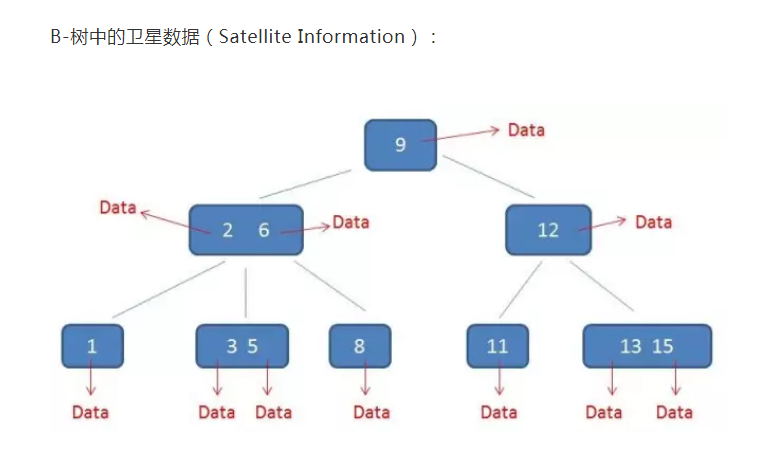
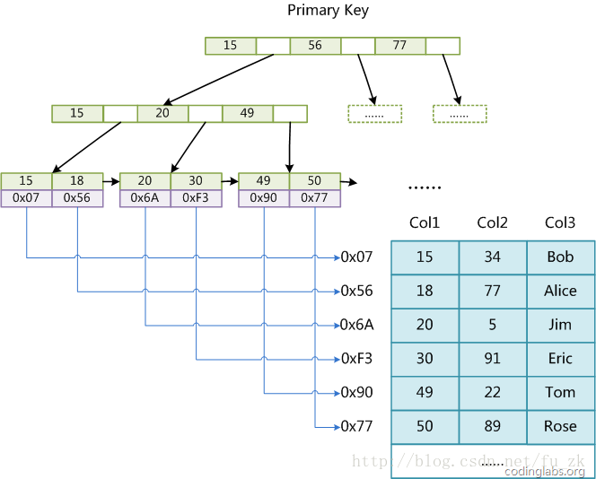
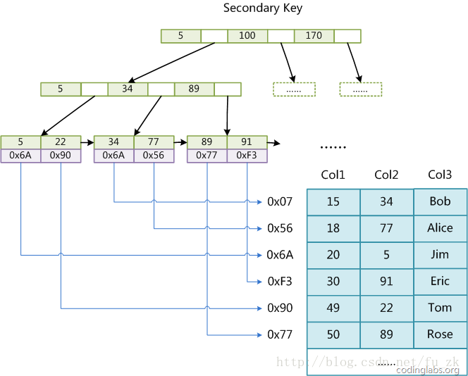
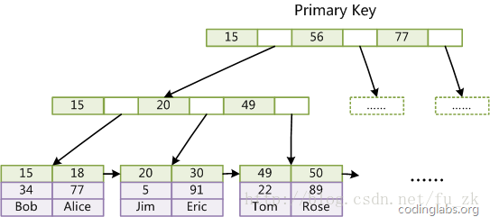
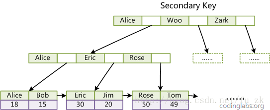

#2019.09.15 自学笔记

##一、B-树和B+树与数据库索引

### 1. 什么是B-树？

B树（Balance Tree）是一种多路平衡查找树，他的**每一个节点最多包含M个孩子，M就是B树的阶。**

M的大小取决于磁盘页的大小。

**注：B-树就是B树，中间的横线不是减号，所以不要读成B减树。**

**m阶B树：**

1、 树中**每个结点至多有m个子结点（即M阶）；** 

2、 若根结点不是叶子结点,则至少有2个子结点；

3、 除根结点和叶子结点外,其它每个结点至少有ceil(m/2)个子结点；

注：[ceil(m / 2)]个子结点（其中ceil(x)是一个取上限的函数）； 

即**中间节点最少有ceil(m/2)个子结点。**

4、 **所有叶子结点都出现在同一层**，叶子结点不包含任何关键字信息；

5、有k个子结点的非终端结点恰好包含有k-1个关键字(单节点里元素)。

每个节点中元素个数n必须满足： [ceil(m / 2)-1]<= n <= m-1。(***即M阶树单节点最多有M-1个元素***)

**每个结点中关键字从小到大排列，**并且当该结点的孩子是非叶子结点时，该k-1个关键字正好是k个孩子包含的关键字的值域的分划。

因为叶子结点不包含关键字,所以可以把叶子结点看成在树里实际上并不存在外部结点,指向这些外部结点的指针为空,叶子结点的数目正好等于树中所包含的关键字总个数加1.

B-树中的一个包含n个关键字,n+1个指针的结点的一般形式为：（n,P0,K1,P1,K2,P2,…,Kn,Pn） 其中：

​       a)   Ki (i=1...n)为关键字，且关键字按顺序升序排序K(i-1)< Ki。 

​       b)   Pi为指向子树根的接点，且指针P(i-1)指向子树种所有结点的关键字均小于Ki，但都大于K(i-1)。 

​       c)   关键字的个数n必须满足： [ceil(m / 2)-1]<= n <= m-1。

#### **总结：**

m阶的B-树：

1. 每个结点至多有m个子结点
2. 根结点至少有2个子结点
3. 中间节点至少有ceil(m/2)个子结点
4. 所有叶子结点都出现在同一层
5. 单节点最多有m-1个元素,一个节点的子节点数量会比元素个数多1

B树的结构图如下：



#### 2. B+树

**MYSQL使用B+树做索引。**

一个m阶的B+树具有如下几个特征：

1.有k个子树的**中间节点包含有k个元素（B树中是k-1个元素）**，**每个元素不保存数据，只用来索引，所有数据都保存在叶子节点。**

2.**所有的叶子结点中包含了全部元素的信息**，及指向含这些元素记录的指针，且**叶子结点本身依关键字的大小自小而大顺序链接。**

3.**每个父节点的元素都同时存在于子节点中，是子节点中的最大（或最小）元素。**

 

根节点的最大元素是整个B+树的最大元素。

由于父节点的元素都包含在子节点，因此所有叶子节点包括了全部的元素信息。

每个叶子节点都带有指向下一个节点的指针，形成一个有序链表。

**B+树的好处主要体现在查询性能上：**

**单行查询：**

B+树会自顶向下逐层查找节点，最终找到匹配的叶子节点。

看起来跟B-树差不多，但其实有两点差别：

**1、B+树中间节点没有卫星数据，所以同样大小的磁盘页上可以容纳更多节点元素。**

这就意味着，数据量相同的情况下，B+树结构比B-树更加矮胖，因此**查询时IO会更少。**

 

**2、B+树的查询必须最终找到叶子节点，而B-树只需要找到匹配的元素即可**，无论匹配元素是中间节点还是叶子节点。

**因此B-树的查找性能不稳定（最好情况是只查根节点，最坏查到叶子节点），而B+树每次查找都是稳定点 。**

 

**范围查询：**

**B-树只能依靠**繁琐的**中序遍历**，而**B+树只需要在链表上遍历**即可。


#### 综合起来，B+树比B-树优势有三个：

1、IO次数更少。(相同大小的磁盘页存储信息比B-树多)

2、查询性能稳定。(信息全部存储在叶子结点中)

3、范围查询简便。(叶子结点有指针相连)

B+树的结构图如下：


### 3. 数据库索引

添加索引是加速数据库**查找、排序**的重要方式。 索引的创建原则如下：

1．选择唯一性索引

唯一性索引的值是唯一的，可以更快速的通过该索引来确定某条记录。例如，学生表中学号是具有唯一性的字段。为该字段建立唯一性索引可以很快的确定某个学生的信息。如果使用姓名的话，可能存在同名现象，从而降低查询速度。

2．为经常需要排序、分组和联合操作的字段建立索引

经常需要ORDER BY、GROUP BY、DISTINCT和UNION等操作的字段，排序操作会浪费很多时间。如果为其建立索引，可以有效地避免排序操作。

3．为常作为查询条件的字段建立索引

如果某个字段经常用来做查询条件，那么该字段的查询速度会影响整个表的查询速度。因此，为这样的字段建立索引，可以提高整个表的查询速度。

4．限制索引的数目

索引的数目不是越多越好。每个索引都需要占用磁盘空间，索引越多，需要的磁盘空间就越大。修改表时，对索引的重构和更新很麻烦。越多的索引，会使更新表变得很浪费时间。

5．尽量使用数据量少的索引

如果索引的值很长，那么查询的速度会受到影响。例如，对一个CHAR(100)类型的字段进行全文检索需要的时间肯定要比对CHAR(10)类型的字段需要的时间要多。

6．尽量使用前缀来索引

如果索引字段的值很长，最好使用值的前缀来索引。例如，TEXT和BLOG类型的字段，进行全文检索会很浪费时间。如果只检索字段的前面的若干个字符，这样可以提高检索速度。 (这条准则适用于**聚集索引**)

7．删除不再使用或者很少使用的索引

表中的数据被大量更新，或者数据的使用方式被改变后，原有的一些索引可能不再需要。数据库管理员应当定期找出这些索引，将它们删除，从而减少索引对更新操作的影响。

8 . 最左前缀匹配原则，非常重要的原则。

mysql会一直向右匹配直到遇到范围查询(>、<、between、like)就停止匹配，比如a=1 and b=2 and c=> 3 and d = 4， 如果建立(a,b,c,d)顺序的索引，d是用不到索引的，如果建立(a,b,d,c)的索引则都可以用到，a,b,d的顺序可以任意调整。

9 .=和in可以乱序。

比如a = 1 and b = 2 and c = 3 建立(a,b,c)索引可以任意顺序，mysql的查询优化器会帮你优化成索引可以识别的形式

10 . 尽量选择区分度高的列作为索引。

区分度的公式是count(distinct col)/count(*)，表示字段不重复的比例，比例越大我们扫描的记录数越少，唯一键的区分度是1，而一些状态、性别字段可能在大数据面前区分度就 是0，那可能有人会问，这个比例有什么经验值吗？使用场景不同，这个值也很难确定，一般需要join的字段我们都要求是0.1以上，即平均1条扫描10条 记录

11 .索引列不能参与计算，保持列“干净”。

比如from_unixtime(create_time) = ’2014-05-29’就不能使用到索引，原因很简单，b+树中存的都是数据表中的字段值，但进行检索时，需要把所有元素都应用函数才能比较，显然成本太大。所以语句应该写成create_time = unix_timestamp(’2014-05-29’);

12 .尽量的扩展索引，不要新建索引。 
比如表中已经有a的索引，现在要加(a,b)的索引，那么只需要修改原来的索引即可。


**在mysql中，数据库索引是适用B+树的结构实现的。**

1. 为什么使用B树而不是哈希散列的方式创建索引？

   我们都知道，哈希散列也可以实现索引的功能，那为什么使用更加简洁的哈希散列呢？

   hash结构的特点：检索效率非常高，索引的检索可以一次到位，O(1)。

   如果是等值查询，那么哈希索引明显有绝对优势，因为只需要经过一次算法即可找到相应的键值；当然了，这个前提是，键值都是唯一的。如果键值不是唯一的，就需要先找到该键所在位置，然后再根据链表往后扫描，直到找到相应的数据；

   但如果是范围查询检索（数据库经常会用到），这时候哈希索引就毫无用武之地了，因为原先是有序的键值，经过哈希算法后，有可能变成不连续的了，就没办法再利用索引完成范围查询检索；

   同理，哈希索引也没办法利用索引完成排序，以及like ‘xxx%’ 这样的部分模糊查询（这种部分模糊查询，其实本质上也是范围查询）；

   哈希索引也不支持多列联合索引的最左匹配规则；

   B+树索引的关键字检索效率比较平均，不像B树那样波动幅度大，在有大量重复键值情况下，哈希索引的效率也是极低的，因为存在所谓的哈希碰撞问题。

   综合来说在数据库这种应用场景下，B树的结构更加适合。

   

2. 什么是聚集索引和非聚集索引？

   在MySQL中，索引属于存储引擎级别的概念，**不同存储引擎对索引的实现方式是不同的**，我们主要讨论**MyISAM和InnoDB两个存储引擎(MySQL数据库MyISAM和InnoDB存储引擎的比较)的索引实现方式。**

    

   **MyISAM索引实现**

   MyISAM引擎使用B+Tree作为索引结构，**叶结点的data域存放的是数据记录的地址**。下面是MyISAM索引的原理图：

   

这里设表一共有三列，**假设我们以Col1为主键，则上图是一个MyISAM表的主索引（Primary key）示意**。可以看出MyISAM的索引文件仅仅保存数据记录的地址。**在MyISAM中，主索引和辅助索引（Secondary key）在结构上没有任何区别，只是主索引要求key是唯一的，而辅助索引的key可以重复。**如果我们在Col2上建立一个辅助索引，则此索引的结构如下图所示：




同样也是一颗B+Tree，data域保存数据记录的地址。**因此，MyISAM中索引检索的算法为首先按照B+Tree搜索算法搜索索引，如果指定的Key存在，则取出其data域的值，然后以data域的值为地址，读取相应数据记录。**

**MyISAM的索引方式也叫做“非聚集”的，之所以这么称呼是为了与InnoDB的聚集索引区分。**

**注意：**

**主索引和辅助索引都是B+树，叶子节点都存储的是数据记录的地址，索引文件和数据文件是分离的，主索引和辅助索引都不会影响数据文件。**


**InnoDB索引实现**

虽然InnoDB也使用B+Tree作为索引结构，**但具体实现方式却与MyISAM截然不同。**

**第一个重大区别是InnoDB的数据文件本身就是索引文件**。从上文知道，**MyISAM索引文件和数据文件是分离的，索引文件仅保存数据记录的地址。而在InnoDB中，表数据文件本身就是按B+Tree组织的一个索引结构，这棵树的叶结点data域保存了完整的数据记录。**这个索引的key是数据表的主键，因此InnoDB表数据文件本身就是主索引。




上图是InnoDB主索引（同时也是数据文件）的示意图，可以看到**叶结点包含了完整的数据记录。这种索引叫做聚集索引。**  **因为InnoDB的数据文件本身要按主键聚集，所以InnoDB要求表必须有主键**（MyISAM可以没有），如果没有显式指定，则MySQL系统会自动选择一个可以唯一标识数据记录的列作为主键，如果不存在这种列，则MySQL自动为InnoDB表生成一个隐含字段作为主键，这个字段长度为6个字节，类型为长整形。

**第二个与MyISAM索引的不同是 InnoDB的辅助索引data域存储相应记录主键的值而不是地址**。换句话说，InnoDB的所有辅助索引都引用主键作为data域。例如，下图为定义在Col3上的一个辅助索引：




这里以英文字符的ASCII码作为比较准则。**聚集索引这种实现方式使得按主键的搜索十分高效，但是辅助索引搜索需要检索两遍索引：首先检索辅助索引获得主键，然后用主键到主索引中检索获得记录。**

了解不同存储引擎的索引实现方式对于正确使用和优化索引都非常有帮助，例**如知道了InnoDB的索引实现后，就很容易明白为什么不建议使用过长的字段作为主键，因为所有辅助索引都引用主索引，过长的主索引会令辅助索引变得过大。**再例如，用非单调的字段作为主键在InnoDB中不是个好主意，因为InnoDB数据文件本身是一颗B+Tree，非单调的主键会造成在插入新记录时数据文件为了维持B+Tree的特性而频繁的分裂调整，十分低效，而使用自增字段作为主键则是一个很好的选择。


## 二、 sql编程题

1. 输出用户表里重名的用户
   `select name from tab group by name having count(*) > 1`

2. 一个表包含客户名和转账信息，求所有客户的转账总和

   `select name, sum(trans) as total from tab group by name`

3. 查询每科成绩前三的同学信息。

   ```sql
   select * from 
   ( 
   select subject,name,score,ROW_NUMBER() over(PARTITION by subject order by score desc) as num from score 
   ) T where T.num <= 3 order by subject 
   ```

   (这个题一定要看懂)